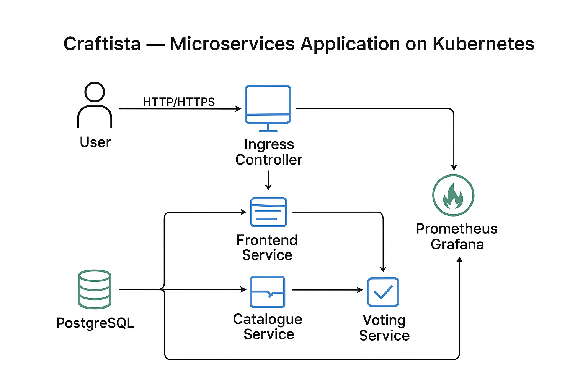

# Kraftista - The Kubernetes + DevOps Implementation of Polyglot Microservices App Craftista

## 🔹 Architecture



---

## How to run

### 1. Start Minikube

```
minikube start --driver=docker
```

### 2. Enable ingress

```
minikube addons enable ingress
```

### 3. Apply all manifests

```
kubectl apply -f k8s/
```

### 4. Add this to your /etc/hosts

```
sudo vim /etc/hosts
<your-minikube-ip>  craftista.local

```

### 5. Then run

```
minikube tunnel
(run this on a separate terminal and leave it running)

```

### 6. Monitoring Setup

### Prometheus

```
helm repo add prometheus-community https://prometheus-community.github.io/helm-charts
helm install prometheus prometheus-community/prometheus
```

### Access

```
minikube service prometheus-server-ext
```

### Grafana

```
helm install grafana grafana/grafana
```

### Access

```
minikube service grafana-ext
```

### Retrieve admin password

```
kubectl get secret grafana -o jsonpath="{.data.admin-password}" | base64 --decode
```

### 7. Access the application

```
curl http://craftista.local
curl http://craftista.local/voting
curl http://craftista.local/catalogue
```
